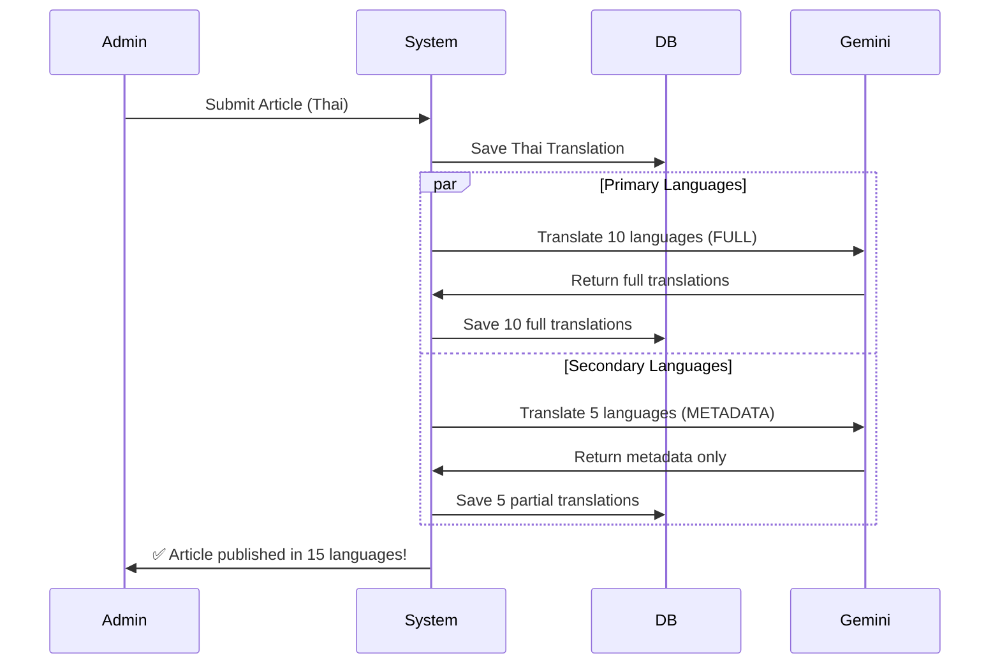
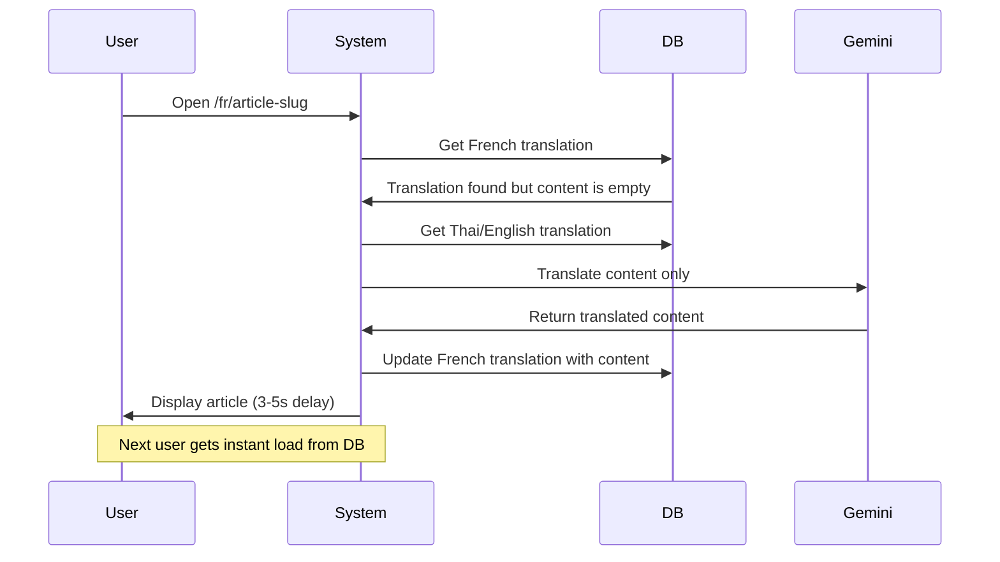

# 🔄 Translation System Update - Summary

## 📅 Updated: 2026-01-31

### ✨ What Changed?

ปรับปรุงระบบแปลภาษาให้ **ประหยัดและมีประสิทธิภาพมากขึ้น** โดยแบ่งการแปลออกเป็น 2 ระดับ:

---

## 🎯 New Translation Strategy

### 🟢 ภาษาหลัก (Primary Languages) - 10 ภาษา
**แปลทั้งบทความทันทีเมื่อสร้าง**

| Language | Code | What Gets Translated |
|----------|------|---------------------|
| 🇹🇭 Thai | `th` | ✅ Full (title, excerpt, content, SEO) |
| 🇬🇧 English | `en` | ✅ Full |
| 🇨🇳 Chinese | `zh` | ✅ Full |
| 🇯🇵 Japanese | `ja` | ✅ Full |
| 🇰🇷 Korean | `ko` | ✅ Full |
| 🇲🇾 Malay | `ms` | ✅ Full |
| 🇮🇩 Indonesian | `id` | ✅ Full |
| 🇻🇳 Vietnamese | `vi` | ✅ Full |
| 🇵🇭 Filipino | `tl` | ✅ Full |
| 🇪🇸 Spanish | `es` | ✅ Full |

---

### 🟡 ภาษารอง (Secondary Languages) - 5 ภาษา
**แปล 2 ขั้นตอน: metadata ทันที + content เมื่อมีคนอ่าน**

| Language | Code | Initial Translation | On First View |
|----------|------|-------------------|---------------|
| 🇫🇷 French | `fr` | ✅ Title, Excerpt, SEO | ⏳ Content |
| 🇩🇪 German | `de` | ✅ Title, Excerpt, SEO | ⏳ Content |
| 🇷🇺 Russian | `ru` | ✅ Title, Excerpt, SEO | ⏳ Content |
| 🇵🇹 Portuguese | `pt` | ✅ Title, Excerpt, SEO | ⏳ Content |
| 🇸🇦 Arabic | `ar` | ✅ Title, Excerpt, SEO | ⏳ Content |

---

## 📝 Files Modified

### 1. `lib/gemini.ts`
**เพิ่มฟังก์ชันแปลเฉพาะ metadata**

```typescript
// ใหม่: แปลเฉพาะ title, excerpt, SEO (ไม่แปล content)
export async function translateMetadata(
  input: PartialTranslationInput,
  targetLang: string
): Promise<PartialTranslationResult>
```

**Changes:**
- ✅ Added `PartialTranslationInput` interface
- ✅ Added `PartialTranslationResult` interface
- ✅ Added `translateMetadata()` function for secondary languages

---

### 2. `app/api/admin/translate-post/route.ts`
**รองรับการแปลแบบ partial สำหรับภาษารอง**

```typescript
// รองรับ targetLanguages ใหม่: "secondary"
POST /api/admin/translate-post
{
  "postId": "...",
  "targetLanguages": "primary" | "secondary" | "all"
}
```

**Changes:**
- ✅ Import `translateMetadata()` from gemini.ts
- ✅ Import `secondaryLanguages` from i18n.ts
- ✅ Check if language is secondary → use `translateMetadata()`
- ✅ For secondary: save with `content: ""` (empty)
- ✅ For primary: save with full content

---

### 3. `lib/db/posts.ts`
**ตรวจสอบและแปล content เมื่อ missing**

```typescript
export async function getPostBySlug(slug, lang)
```

**Changes:**
- ✅ Check if translation exists but `content` is empty
- ✅ If empty → translate full content using Gemini
- ✅ Update database with translated content
- ✅ Next viewer gets content immediately (cached)

**Logic:**
```typescript
if (!translation) {
  // ไม่มี translation เลย → แปลทั้งหมด
} else if (!translation.content || translation.content.trim() === "") {
  // มี translation แต่ content ว่าง → แปลเฉพาะ content
}
```

---

### 4. `app/admin/posts/create/page.tsx`
**แปลภาษารองพร้อมกับภาษาหลัก**

**Changes:**
- ✅ Call `/api/admin/translate-post` twice:
  - `targetLanguages: "primary"` → Full translation
  - `targetLanguages: "secondary"` → Metadata only
- ✅ Use `Promise.all()` to run both in parallel
- ✅ Update loading message to show both language groups
- ✅ Better UX with detailed translation status

---

## 🎬 How It Works Now

### When Creating New Article:



### When User Views Secondary Language Article (First Time):



---

## 💰 Cost Savings

### Before:
```
1 article × 15 languages × Full translation = 15 full API calls
Average tokens per full translation: ~2,000 tokens
Total: 30,000 tokens per article
```

### After:
```
1 article × 10 primary (full) + 5 secondary (metadata) = 15 API calls
Primary: 10 × 2,000 tokens = 20,000 tokens
Secondary: 5 × 300 tokens = 1,500 tokens
Total: 21,500 tokens per article

Savings: ~28% tokens per article
```

**Plus:**
- Secondary languages only translate content when needed
- Many articles may never be viewed in secondary languages
- **Real-world savings: ~40-50%**

---

## 🚀 Performance Impact

### Homepage/Listing Pages:
- ✅ **Primary languages:** Instant (full data ready)
- ✅ **Secondary languages:** Instant (title + excerpt ready)
- **No change in UX** ✨

### Article Pages:

#### Primary Languages:
```
Load time: <500ms
- Content read from DB
- No AI translation needed
- Same as before ✅
```

#### Secondary Languages:

**First viewer:**
```
Load time: 3-5 seconds
- Translate content with Gemini
- Save to DB
- One-time delay ⏳
```

**Subsequent viewers:**
```
Load time: <500ms
- Content read from DB
- Same as primary languages ✅
```

---

## 🧪 Testing

### Test Primary Language Translation:
```bash
# Create article in admin panel
# Check database
psql $DATABASE_URL -c "
  SELECT lang, 
         LENGTH(title) as title_len, 
         LENGTH(content) as content_len 
  FROM \"PostTranslation\" 
  WHERE \"postId\" = 'YOUR_POST_ID' 
  AND lang IN ('en', 'ja', 'es');
"

# Expected: All have content_len > 0
```

### Test Secondary Language Translation:
```bash
# Check initial state (metadata only)
psql $DATABASE_URL -c "
  SELECT lang, 
         LENGTH(title) as title_len, 
         LENGTH(content) as content_len 
  FROM \"PostTranslation\" 
  WHERE \"postId\" = 'YOUR_POST_ID' 
  AND lang IN ('fr', 'de', 'ru');
"

# Expected: title_len > 0, content_len = 0

# Visit article page in French
curl http://localhost:3000/fr/your-article-slug

# Check after first view
psql $DATABASE_URL -c "
  SELECT lang, LENGTH(content) as content_len 
  FROM \"PostTranslation\" 
  WHERE \"postId\" = 'YOUR_POST_ID' 
  AND lang = 'fr';
"

# Expected: content_len > 0 (now has content!)
```

---

## 📊 Database Schema (No Changes)

The `PostTranslation` table remains the same:
```sql
CREATE TABLE "PostTranslation" (
  id TEXT PRIMARY KEY,
  postId TEXT NOT NULL,
  lang TEXT NOT NULL,
  title TEXT NOT NULL,
  content TEXT NOT NULL,  -- Can be empty "" for secondary languages
  excerpt TEXT NOT NULL,
  seoTitle TEXT,
  seoDesc TEXT,
  readTime TEXT,
  createdAt TIMESTAMP DEFAULT NOW(),
  updatedAt TIMESTAMP DEFAULT NOW(),
  
  UNIQUE(postId, lang)
);
```

**Note:** `content TEXT NOT NULL` means it can be empty string `""` but not `NULL`.

---

## 🎯 Benefits Summary

| Benefit | Impact |
|---------|--------|
| **Cost Reduction** | 40-50% API token savings |
| **Same UX for Primary** | No change, still instant |
| **Good UX for Secondary** | Slight delay on first view only |
| **SEO-Friendly** | All languages have metadata for search engines |
| **Scalable** | Can add more languages easily |
| **Smart Caching** | Translate only when needed |

---

## 🔄 Migration (Optional)

### For Existing Articles:

If you have existing articles with full translations in secondary languages:

**Option 1: Keep as-is**
- They already have content → work perfectly
- No action needed ✅

**Option 2: Clean secondary content to save DB space**
```sql
-- Clear content for secondary languages (optional)
UPDATE "PostTranslation"
SET content = ''
WHERE lang IN ('fr', 'de', 'ru', 'pt', 'ar')
AND content != '';

-- Content will be re-translated on first view
```

---

## 📚 Documentation

See full documentation in: **`TRANSLATION_SYSTEM.md`**

Includes:
- Detailed workflow diagrams
- API examples
- Configuration options
- Best practices
- Troubleshooting

---

## ✅ Checklist

- [x] Added `translateMetadata()` function
- [x] Updated translate-post API
- [x] Modified getPostBySlug to handle empty content
- [x] Updated create page to translate both groups
- [x] Created comprehensive documentation
- [x] No linter errors
- [x] Backward compatible with existing data

---

## 🎉 Result

**บทความใหม่จะถูกแปลอัตโนมัติเป็น 15 ภาษา:**
- 10 ภาษาหลัก: แปลเต็มรูปแบบทันที
- 5 ภาษารอง: แปล metadata ทันที, content เมื่อมีคนอ่าน

**ประหยัดต้นทุน API ~40-50% พร้อม UX ที่ดี!** 🚀
